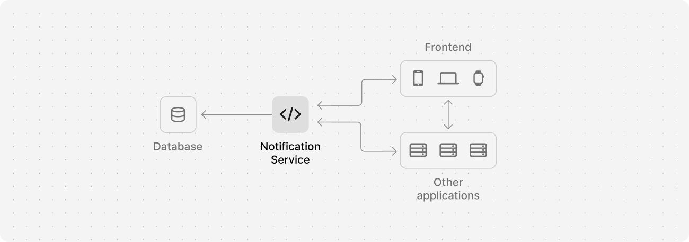

# Notifications microservice

- [About](#about)
  - [Tools](#tools)
  - [API Endpoints](#api-endpoints)
  - [Data types](#data-types)
- [Showcase and examples](#showcase-and-examples)
- [Installing and running](#installing-and-running)
- [Extra notes](#extra-notes)

<br>

## About

Back-end microservice built with NestJS for managing notifications.

<br>

```
🧪 Unit tests cover all main entities and use-cases.
```

### Tools used

`Typescript`  `NodeJS`  `NestJS`  `Prisma ORM`  `SQLite`  `JestJS`

<br/>

### API Endpoints

| Action | HTTP method | Route | Arguments | Return  |
| --- | --- | --- | --- | --- |
| Create notification  | POST  | / | Notification request object | Notification object
| Get notifications per recipient | GET | /from/:recipientId | Recipient ID | Notifications list
| Count notifications per recipient | GET | /count/from/:recipientId | Recipient ID | Count number
| Set notification as read | PATCH | /read/:id | Notification ID | - |
| Set notification as unread | PATCH | /unread/:id | Notification ID | - |
| Cancel notification | PATCH | /cancel/:id | Notification ID | - |

### Data types

| Data | Type |
| --- | --- |
| Notification ID | string/UUID |
| Recipient ID | string/UUID |
| Notifications count | number |
| Notifications list | Notifications [ ] |

<br/>

#### Notification request object
```TypeScript
{
  "content": String, 
  "recipientId": String,
  "category": String
}
```

<br/>

#### Notification object
```TypeScript
{
  recipientId: string,
  createdAt: Date,
  readAt: Date | null,
  canceledAt: Date | null,
  category: string,
  content: Content,
}
```

<br/>

## Installing and running
Installing dependencies
```
npm install
```
Starting the development server to serve the application locally
```
npm run start:dev
```
Running all unit tests
```
npm run test
```
After installing Prisma, you can run Prisma Studio to visualize database entities
```
npx prisma studio
```

<small style="font-size: 11px; color: rgba(125, 125, 125, 1);">Check out package.json for more scripts.</small>

<br>

## Extra notes

- This project is purely a practical exercise intended for developing and/or showcasing my skills in the tools/techniques/concepts mentioned above. It's not meant to be a complete production-ready solution. Feel free to reach out if you have any questions or simply want to chat about it!
- This exercise was built following the lessons by [Rocketseat](https://www.rocketseat.com.br/). It may or may not have been adapted/redesigned by me.
